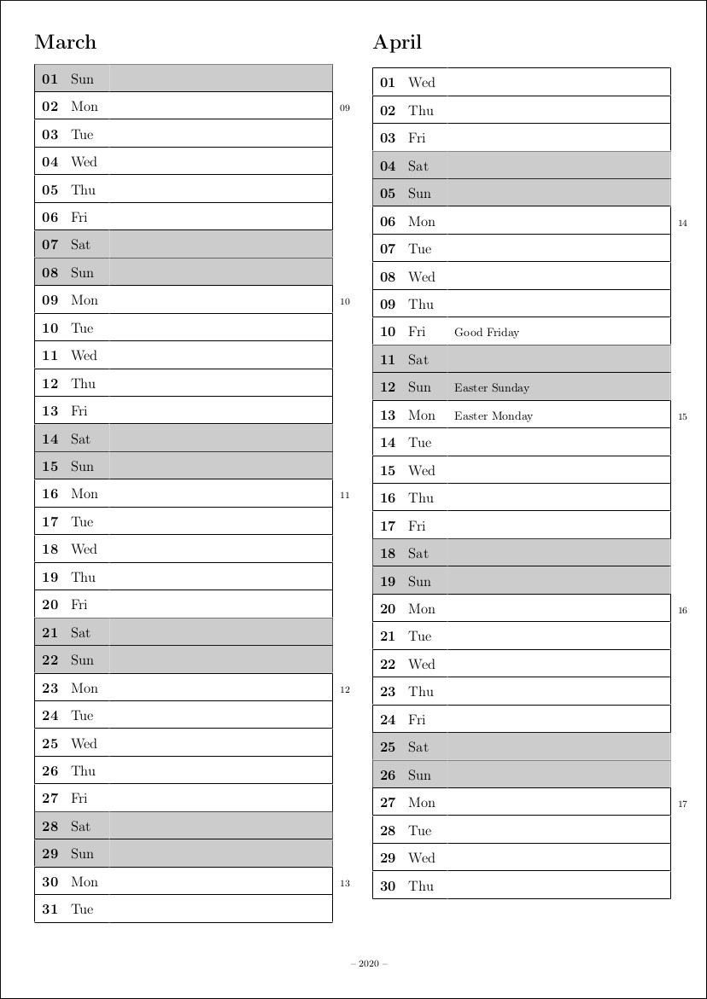
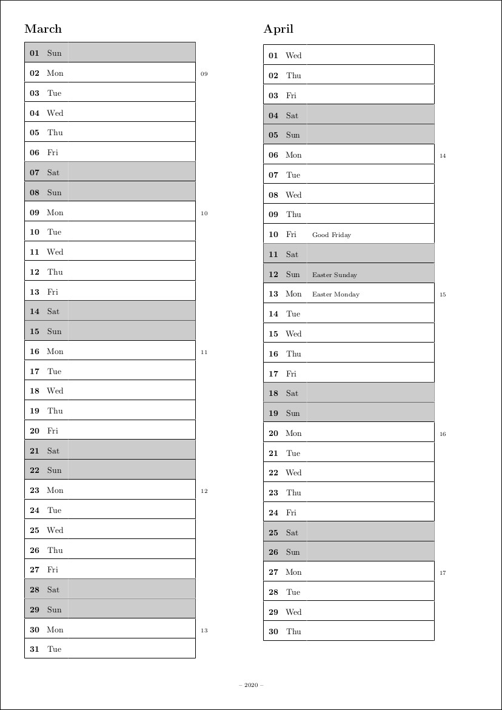
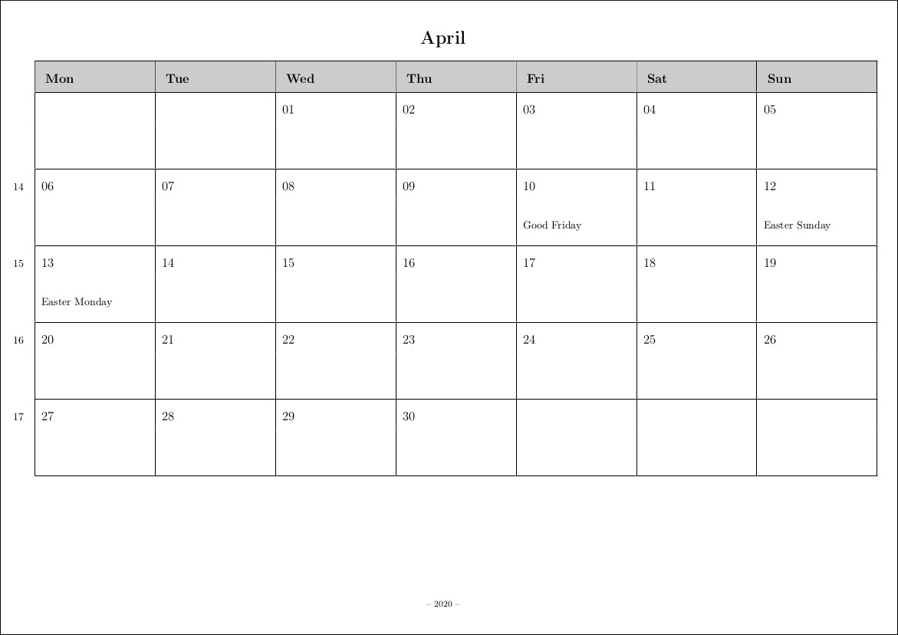

# Calendar Creator
Java program to create annual planning calendars. Program execution results in a `*.tex` file you can easily compile into a `*.pdf` using a TeX compiler of your choice

## Features
* Create a calendar for a certain year
* Automatically add German holidays to that years calendar
* Add custom entries like birthdays to that years calendar
* Save and load configurations for a certain year to a `*.xml` file
* Export a years calendar to a `*.tex` file. You can set the language (English or German) and choose from one of three different layouts
* Desktop application contains a user guide

## How to run on Linux
* Download the repository and enter the project folder
```
$ cd calendar-creator

```

* Assuming [Gradle](https://gradle.org) is installed on your system, run this command to build the app from source
```
$ gradle fatJar
```

* At `build/libs` you should see the following now:
```
build/libs/
└── calendar-creator-all.jar
```

* Assuming [OpenJDK 8](https://openjdk.java.net/install/) is installed on your system, run this command to start the app:
```
/usr/lib/jvm/java-8-openjdk-amd64/jre/bin/java -jar  build/libs/calendar-creator-all.jar
```

* Export your calendar `*.tex` file say to `/tmp/cal2020.tex`
* If you have [TeXLive](https://packages.ubuntu.com/search?keywords=texlive-full) installed on your system, run the following command to compile your calendar
```
pdflatex /tmp/cal2020.tex
```

* Your finished calendar will be saved as `/tmp/cal2020.pdf`

## Demo
### (1) Classic calendar layout


### (2) Layout with larger margin on the right


### (3) Landscape layout


## License
GPL-3.0-or-later
